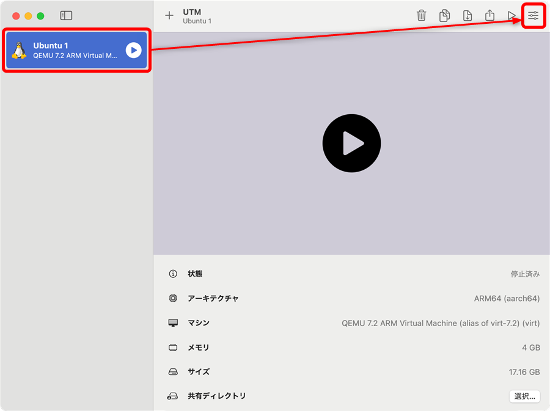
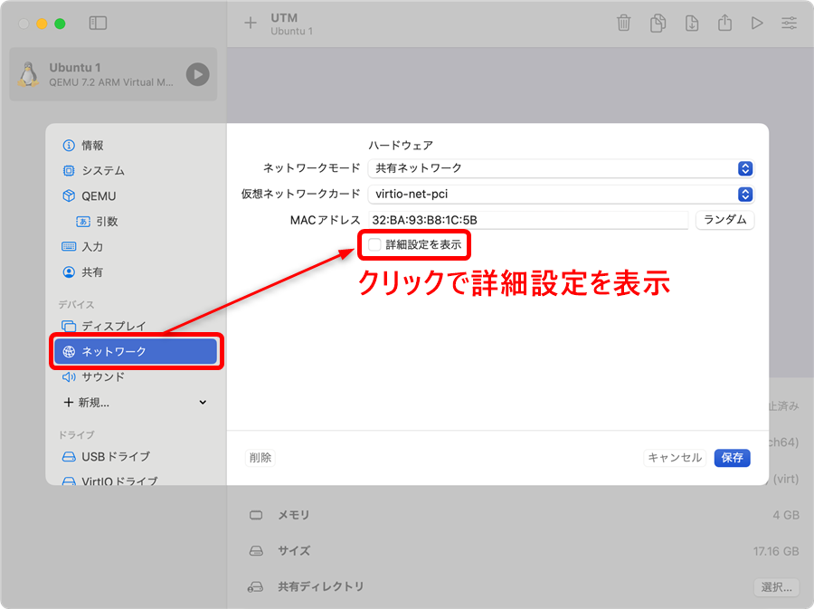
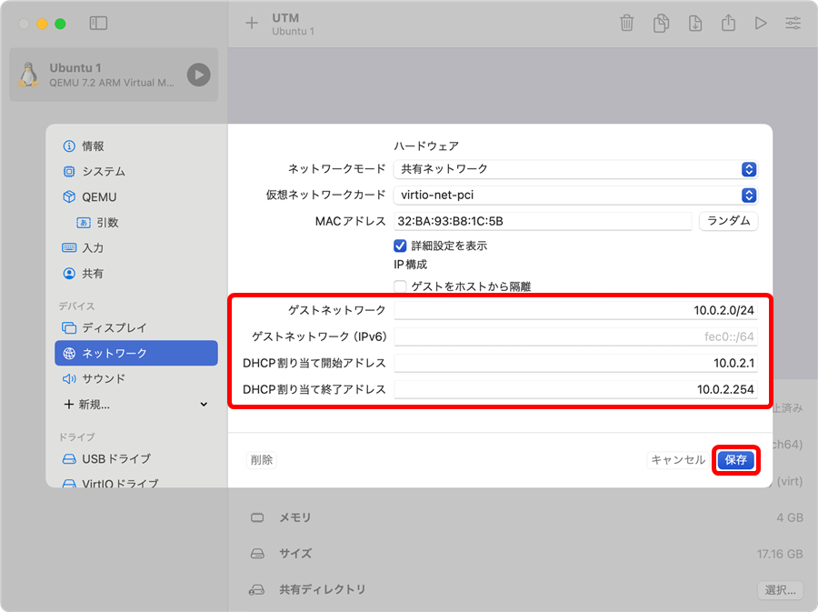
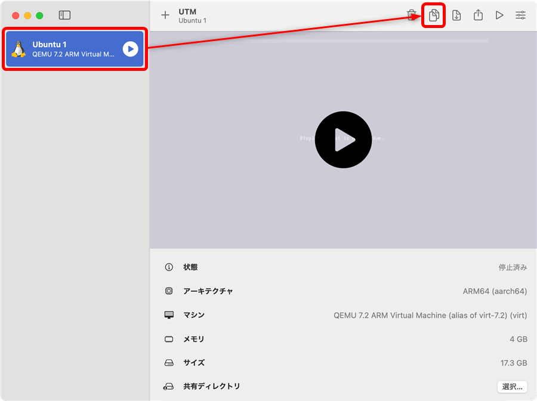
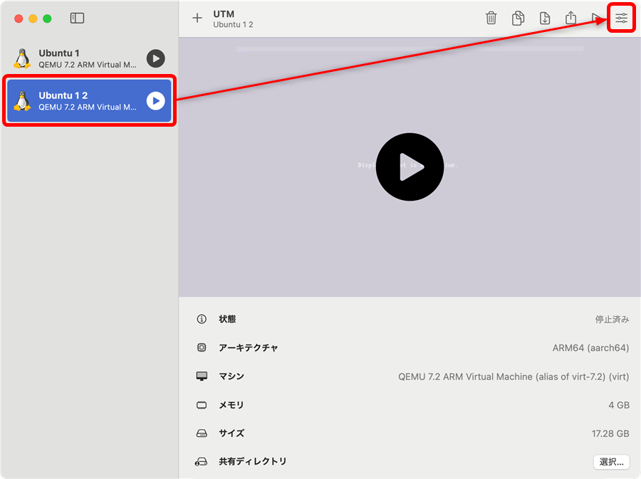
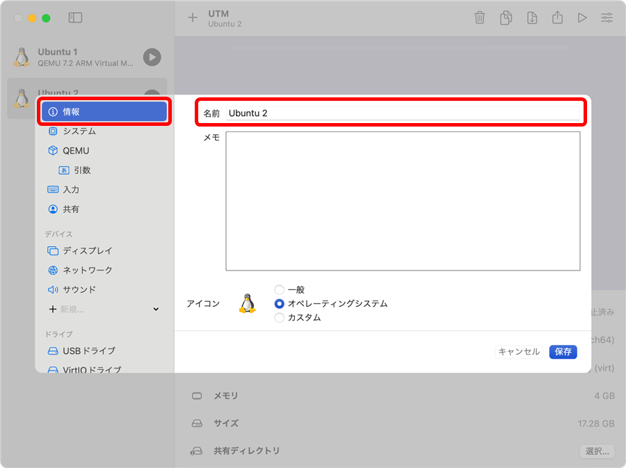
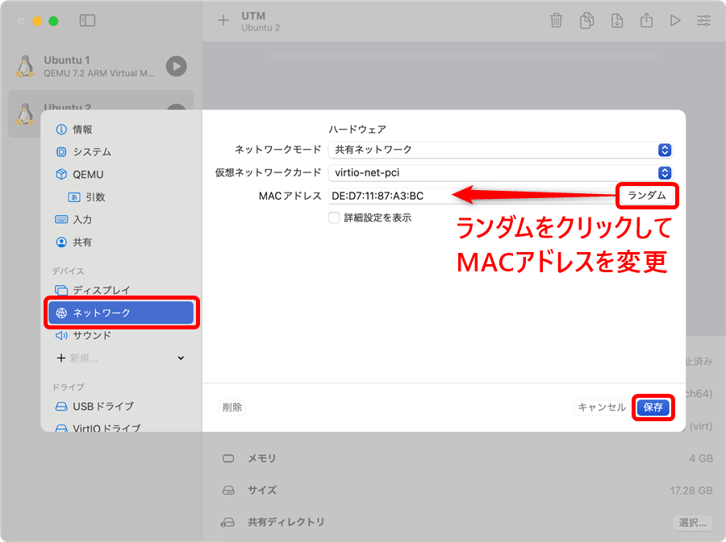
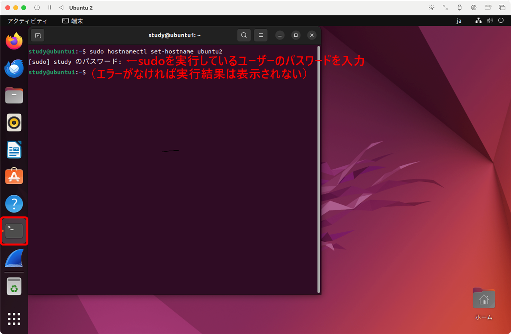
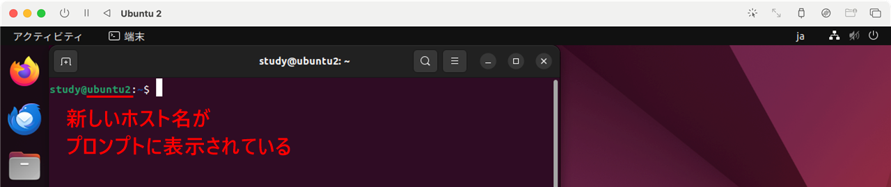

[TCP/IP＆ネットワークコマンド入門 サポートページ](https://nisim-m.github.io/tcpipcmdbook/) ～学習用環境～
# クローンの作成（Part 1）

Part1では2つの仮想マシンどうしで通信を行います。UTMの「複製」機能を使う事で手早く作成できます。
新規マシンとして作成してももちろん問題ありません。
なお、本ステップの中で仮想マシンのネットワークアドレスを本書で使用しているアドレスに変更しているので参考にしてください（変更は任意です）。

<!-- TOC -->
1. [仮想マシンのネットワークを変更する](#仮想マシンのネットワークを変更する)
2. [仮想マシンを複製する](#仮想マシンを複製する)
3. [複製した仮想マシンのMACアドレスを変更する](#複製した仮想マシンのmacアドレスを変更する)
4. [ホスト名を変更する](#ホスト名を変更する)
<!-- /TOC -->

## 仮想マシンのネットワークを変更する

ここでは、ゲストネットワークのアドレスを本書の実行例に合わせて「10.0.2.0/24」に変更しています。
また、これに伴い、DHCP割り当て開始アドレスを「10.0.2.1」※、終了アドレスを「10.0.2.254」にしています。

<small>※UTMの場合、DHCP割り当て開始アドレス（ここでは10.0.2.1）がルーター兼DHCPサーバー（➡p.114 DHCPによる自動割り当て参照）のアドレスになる。</small>

右上の「設定」をクリック

「ネットワーク」で「詳細設定を表示」をクリック

ネットワークアドレスを変更して「保存」

ゲストネットワーク： `10.0.2.0/24`
DHCP割り当て開始アドレス： `10.0.2.1`
DHCP割り当て終了アドレス： `10.0.2.254`

## 仮想マシンを複製する

「複製」で2台目の仮想マシンを作成します。

UTMの「複製」はAPFSファイルシステムのクローン機能が使用されており、複製は一瞬で終わり、ディスクの使用量も増えません。クローンされたファイルに対してなされた変更は、差分データとして保存されるようになっています（コピーオンライト、_Copy-on-Write_）。

仮想マシンを選択して複製をクリック

「すべて複製しますか？」の確認メッセージが出るので「はい」で複製

## 複製した仮想マシンのMACアドレスを変更する

MACアドレスの重複を避けるため、複製した仮想マシンのMACアドレスを変更します。

複製した仮想マシンを選択して設定をクリック

名前を適宜変更する（ここではUbuntu 2）

「ネットワーク」で「ランダム」をクリックしてMACアドレスを変更

## ホスト名を変更する

2台目の仮想マシンのホスト名（コンピューターの名前）を変更します。仮想マシンを起動して以下のコマンドを実行してください。ここでは、ubuntu2という名前にしています。

<code>sudo hostnamectl set-hostname ubuntu2</code>

なお、プロンプト（本文参照）は端末を開き直すことで反映されます。

クローンで作成した仮想マシン（Ubuntu 2）を起動して端末で`sudo hostnamectl set-hostname ubuntu2`を実行

プロンプトに表示されているホスト名は端末を開き直すと反映される

----
[TCP/IP＆ネットワークコマンド入門 サポートページ](https://nisim-m.github.io/tcpipcmdbook/)
