

[TCP/IP＆ネットワークコマンド入門 サポートページ](https://nisim-m.github.io/tcpipcmdbook/) ～学習用環境～

# クローンの作成（Part 1）

Part1では2つの仮想マシンどうしで通信を行います。VirtualBoxの「クローン」機能を使う事で手早く作成でき、ディスクスペースの節約にもなります。
新規マシンとして作成してももちろん問題ありませんが、この場合も、下記手順にある「NATネットワーク」を使用するようにしてください。

<!-- TOC -->
1. [VirtualBoxの「NATネットワーク」とは](#virtualboxのnatネットワークとは)
2. [NATネットワーク用のデバイスを作成する](#natネットワーク用のデバイスを作成する)
   1. [IPv6を有効にする](#ipv6を有効にする)
3. [仮想マシン（1台目）を「NATネットワーク」に変更する](#仮想マシン1台目をnatネットワークに変更する)
4. [クローンを作成する](#クローンを作成する)
5. [ホスト名を変更する](#ホスト名を変更する)

<!-- /TOC -->

## VirtualBoxの「NATネットワーク」とは

VirtualBoxの仮想環境で使用するネットワークはいくつかの種類があり、デフォルトでは「NAT」で設定されています。
VirtualBoxの「NAT」はゲストOSからホストOS、ゲストOSからインターネット接続のみが可能で、ホストOS→ゲストOS、ゲストOS同士の接続はできません。

本書の学習ではホストOS→ゲストOSやゲストOS同士の通信を行いたいため、「NATネットワーク」を使用します。このため、NATネットワーク用のデバイスを作成する必要があります。

なお、標準で用意されている「ブリッジ」でも可能ですが、ブリッジの場合は実環境と同じネットワークを使用することから、テスト用に変更した設定が実環境に影響する可能性があるため、本書の学習では推奨しません。

## NATネットワーク用のデバイスを作成する

VirtualBoxマネージャーの「ツール」→「ネットワーク」の「NATネットワーク」タブでデバイスを作成します。

「ファイル」→「ツール」→「ネットワークマネージャー」

<a href="images/2024-04-28-00-19-12.png">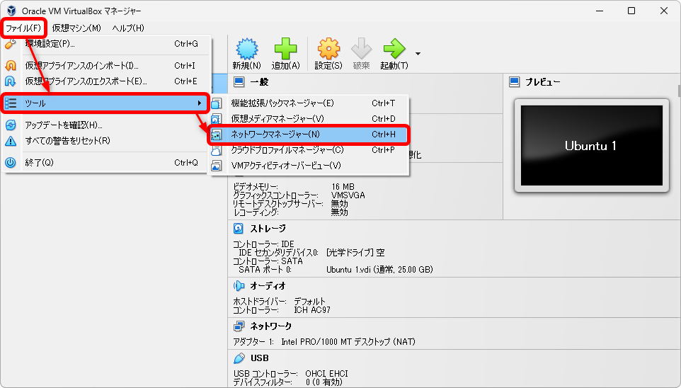</a>

※ネットワークマネージャーは「ツール」→「ネットワーク」からも開く事が可能

<a href="images/2024-04-28-00-16-14.png">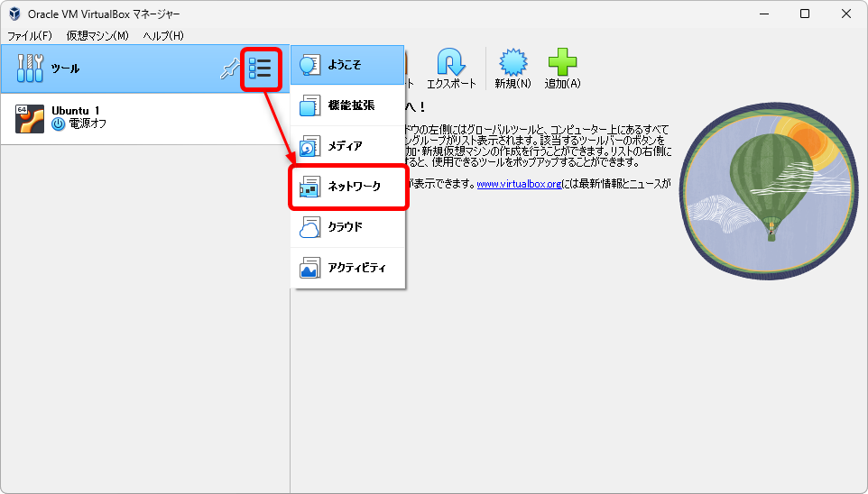</a>

「NAT Networks」タブで「作成」をクリック

<a href="images/2024-04-28-00-20-49.png">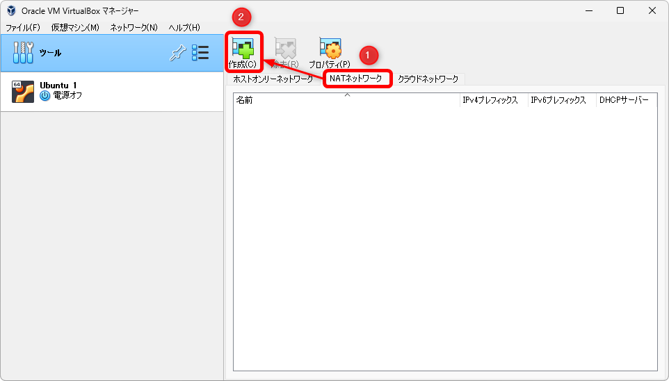</a>

（NatNetworkが作成された）

<a href="images/2024-04-28-00-22-00.png">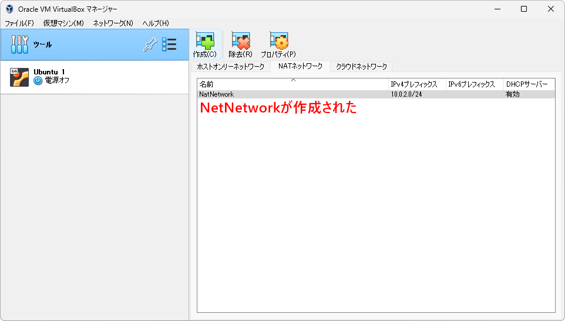</a>

### IPv6を有効にする

通常、仮想環境にIPv6がなくても問題ありませんが、本書ではIPv6の学習にも使用することからIPv6を設定します。

IPv6のネットワークアドレス（ネットワークプレフィックス、➡2.4 IPv6）は以下を使用します。

<code>fd17:625c:f037:2::/64</code>

作成された仮想デバイス「NatNetwork」の「プロパティ」で以下を設定し、「適用」をクリック

<a href="images/2024-04-28-00-35-26.png">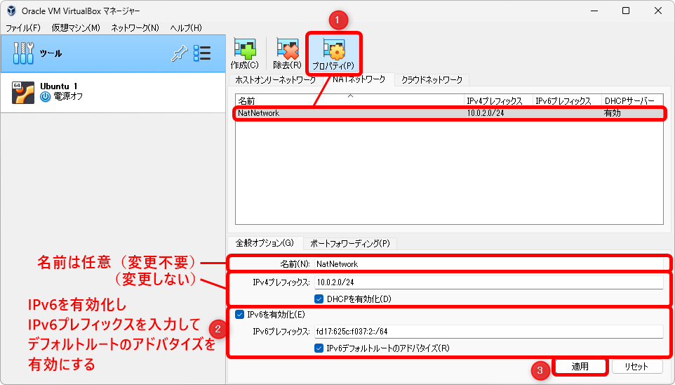</a>

設定内容は以下のとおりです：
名前（任意、変更不要）：`NatNetwork`

IPv4用の設定（変更せず初期値のまま使用）
IPv4プレフィックス：`10.0.2.0/24`
DHCPを有効化: `✓`有効

IPv6用の設定
IPv6を有効化: `✓`有効
IPv6プレフィックス:`fd17:625c:f037:2::/64`
IPv6デフォルトルートのアドバタイズ: `✓`有効

## 仮想マシン（1台目）を「NATネットワーク」に変更する

仮想マシン（1台目）の「設定」→「ネットワーク」でアダプターを「NATネットワーク」に変更し、上で作成したアダプター（NatNetwork）を割り当てます。

仮想マシンを選択して「設定」をクリック

<a href="images/2024-04-28-00-41-59.png">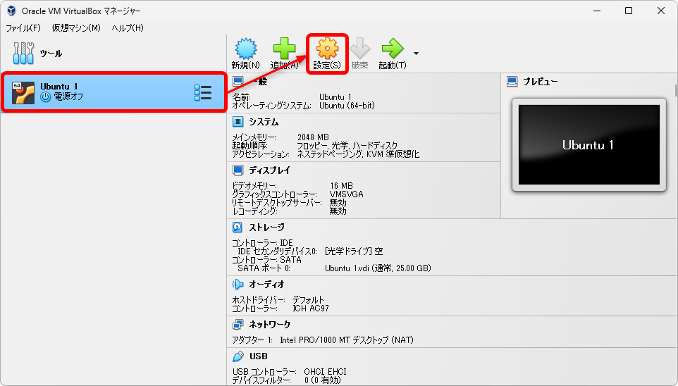</a>

設定画面が開く

<a href="images/2024-04-28-00-42-26.png">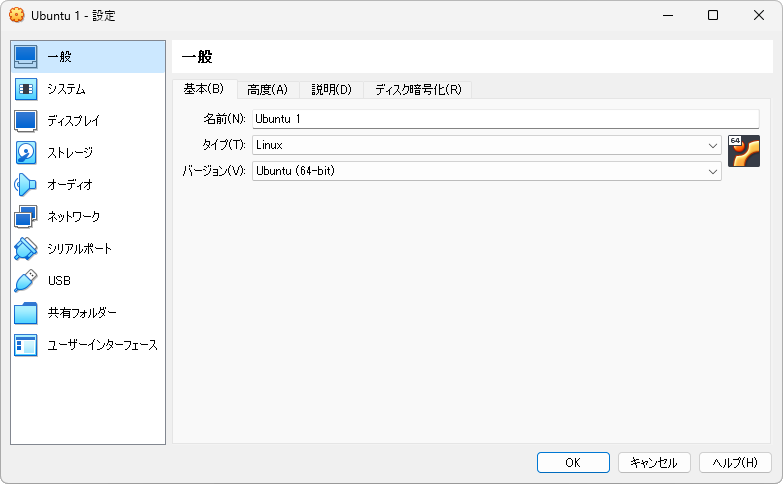</a>

「ネットワーク」で「アダプター1」の割り当てを「NATネットワーク」にする

<a href="images/2024-04-28-00-44-12.png">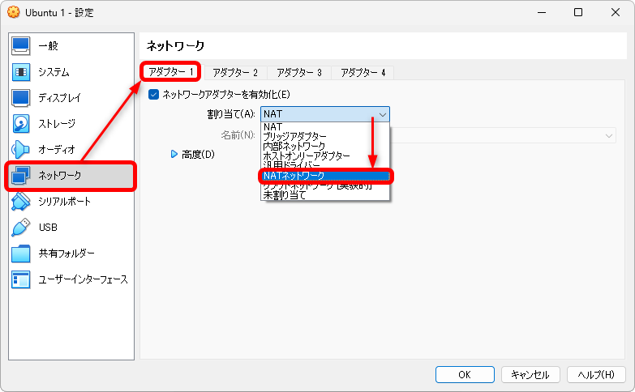</a>

「名前」で「NatNetwork」を選択して「OK」をクリック

<a href="images/2024-04-28-00-45-23.png">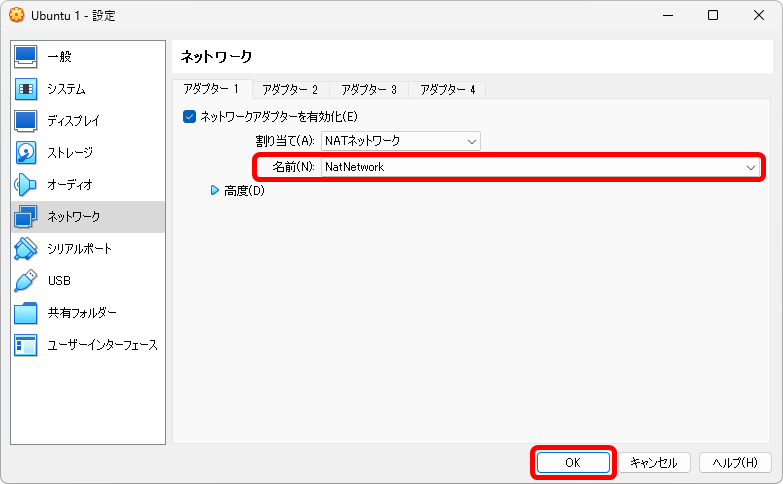</a>

## クローンを作成する

仮想環境のクローンを作成します。クローン元の仮想マシンは電源オフの状態になっている必要があるため、Ubuntu1が「動作中」の状態になっている場合はシャットダウンしてください。

ここでは、2台目の仮想マシンを「Ubuntu 2」として作成しています。また、MACアドレスのポリシーで「すべてのネットワークアダプターでMACアドレスを生成」を選択してください。

仮想マシン（1台目）を選択した状態で「仮想マシン」→「クローン」

<a href="images/2024-04-28-00-51-47.png">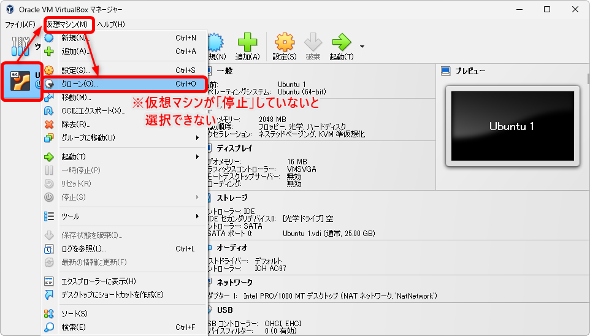</a>

名前を変更（Ubuntu 2、任意）してMACアドレスのポリシーで「すべてのネットワークアダプターでMACアドレスを生成」を選択する

<a href="images/2024-04-28-00-54-59.png">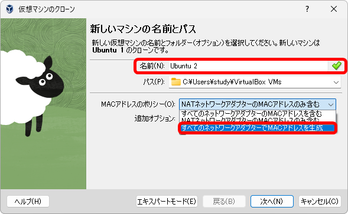</a>

<small>※クローンで作成した仮想マシンは元の仮想マシンと異なるMACアドレス（➡1.1 ネットワークデバイスとMACアドレス）にするため新しいMACアドレスを生成するよう設定しています。 この設定を忘れた場合、クローンで作成した仮想マシンの「設定」→「ネットワーク」のアダプター1で「高度」を選択し、MACアドレスの右側にある丸い矢印ボタンをクリックして新しいMACアドレスを生成してください。なお、MACアドレスを変更するには仮想マシンを電源オフの状態にしておく必要があります。</small>

「OK」をクリック

<a href="images/2024-04-28-01-03-04.png">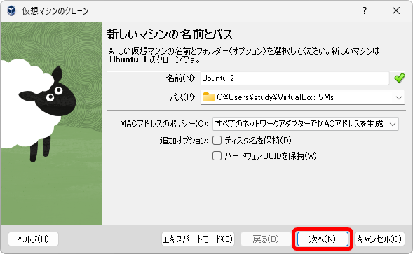</a>

「リンクしたクローン」を選択して「完了」をクリック

<a href="images/2024-04-28-01-03-09.png">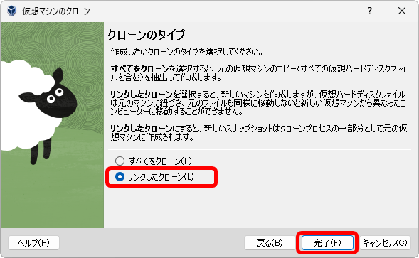</a>

クローンの作成は、仮想マシンのファイルをコピーして作成する「すべてをクローン」と、クローン元のファイルを利用する「リンクしたクローン」の2種類がありますが、今回の目的の場合「リンクしたクローン」で問題ありません。これはスナップショット（仮想マシンの状態を保存する機能、参考→<a href="linuxcmdbook/howto/install-ubuntu.html#スナップショットの活用"スナップショットの活用</a>）のように、新しいマシンが作成元のファイルからの差分という形で作成されるのでディスクスペースの節約となります。

2台目の仮想マシン（Ubuntu 2）が作成できた

<a href="images/2024-04-28-01-07-52.png">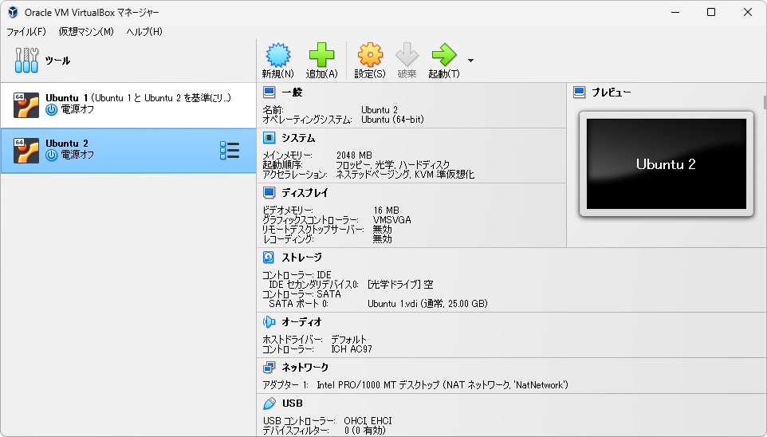</a>

## ホスト名を変更する

2台目の仮想マシンのホスト名（コンピューターの名前）を変更します。仮想マシンを起動して以下のコマンドを実行してください。ここでは、ubuntu2という名前にしています。

<code>sudo hostnamectl set-hostname ubuntu2</code>

なお、プロンプト（本文参照）は端末を開き直すことで反映されます。

クローンで作成した仮想マシン（Ubuntu 2）を起動して端末で`sudo hostnamectl set-hostname ubuntu2`を実行

<a href="images/2024-04-28-07-51-16.png">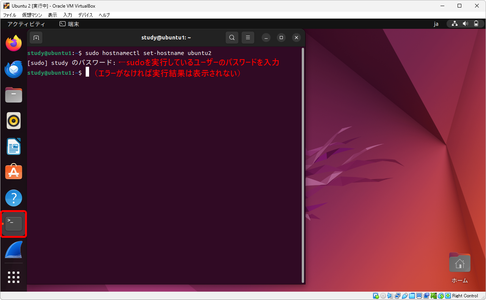</a>

プロンプトに表示されているホスト名は端末を開き直すと反映される

<a href="images/2024-04-28-07-54-25.png">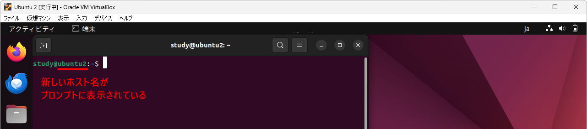</a>

----
[TCP/IP＆ネットワークコマンド入門 サポートページ](https://nisim-m.github.io/tcpipcmdbook/)
