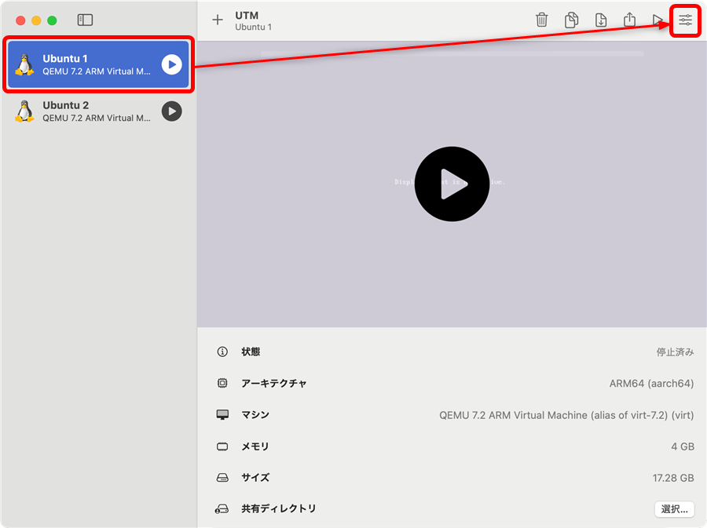
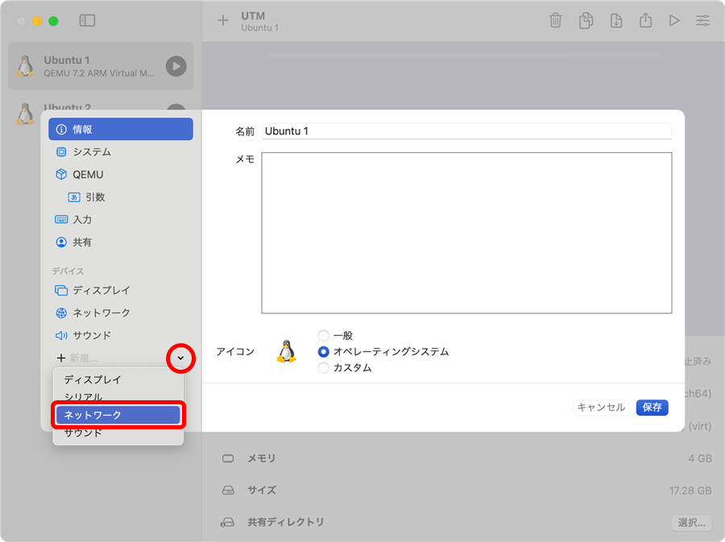
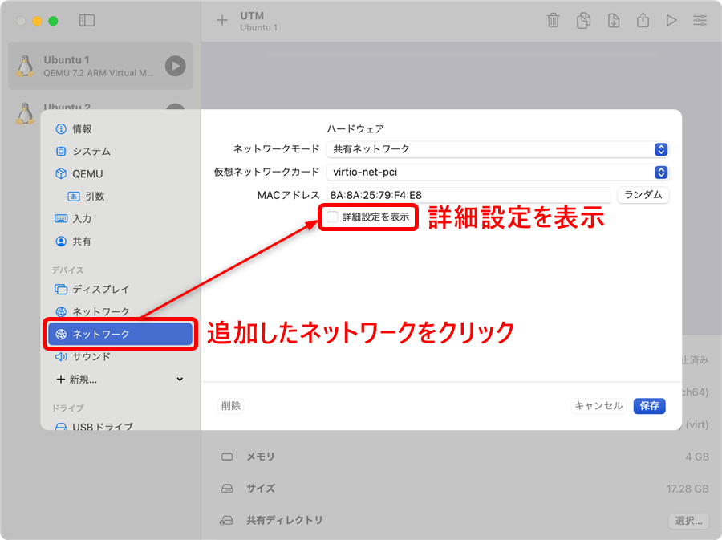
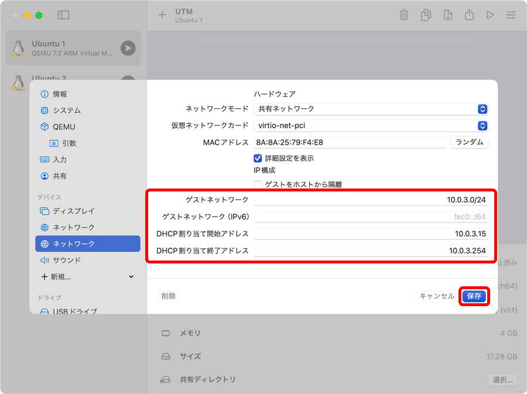
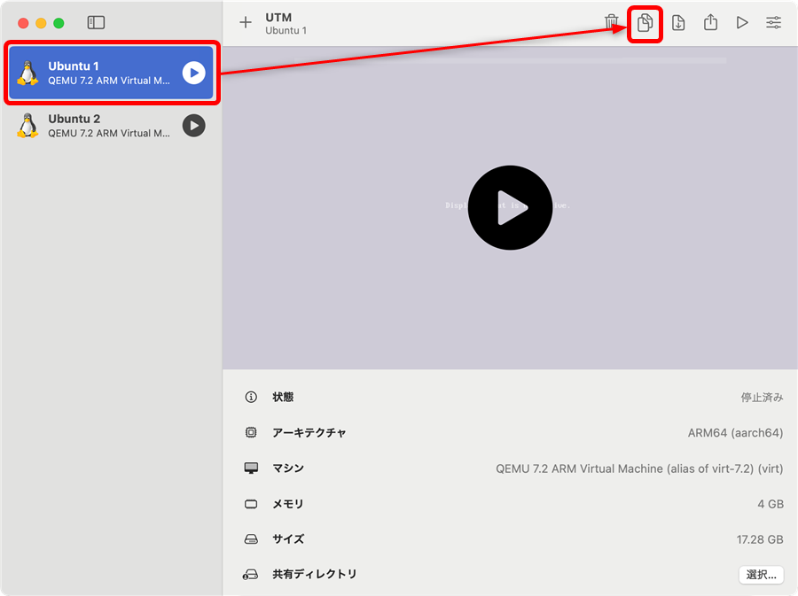
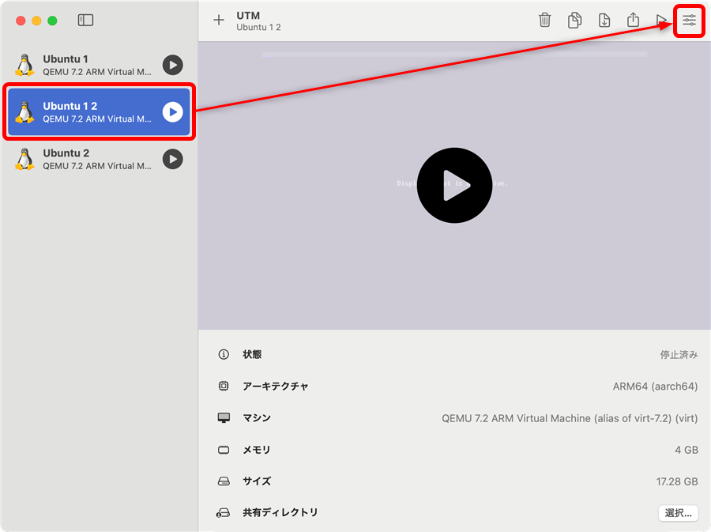
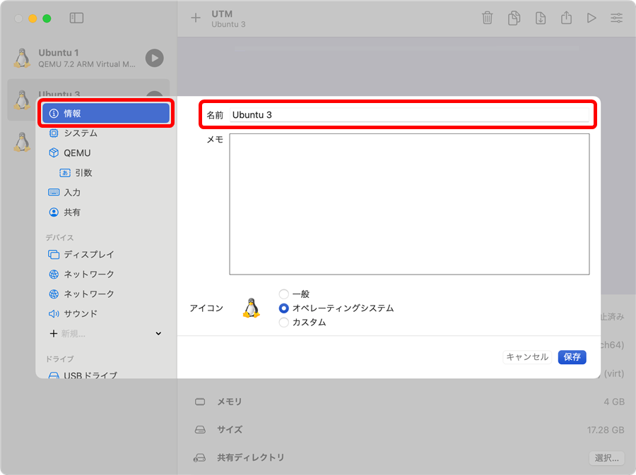
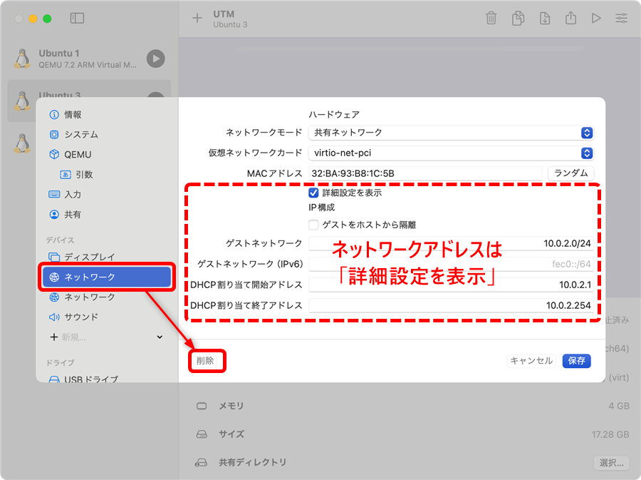
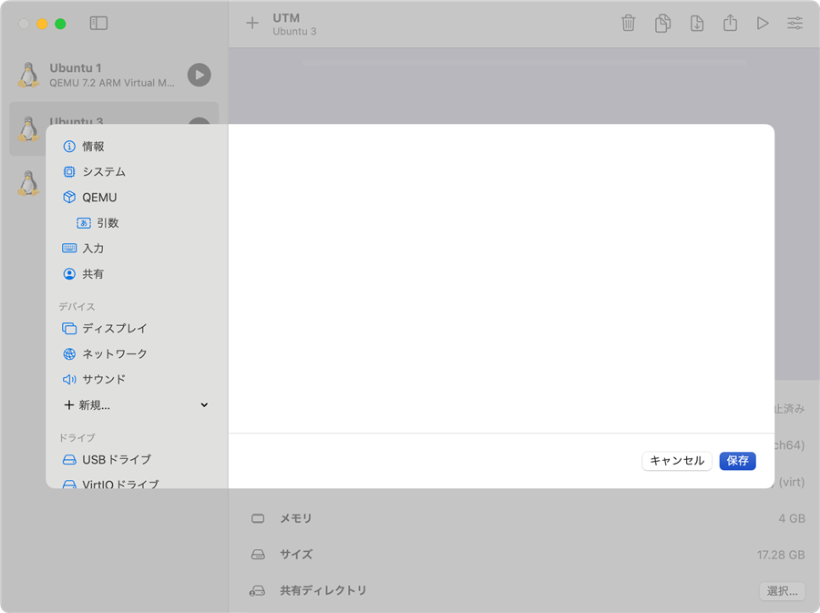
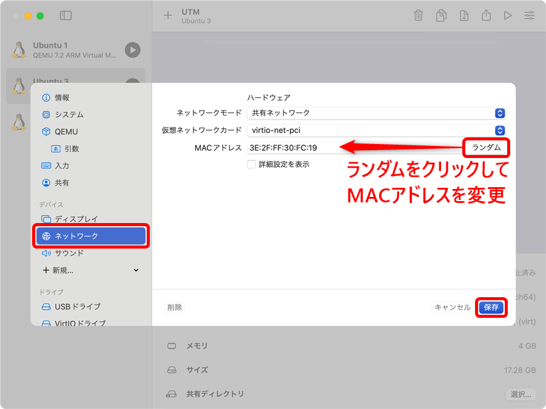

[TCP/IP＆ネットワークコマンド入門 サポートページ](https://nisim-m.github.io/tcpipcmdbook/) ～学習用環境～
# クローンの作成（Part 2）

2.7「異なるネットワークとの通信を試してみよう」では、テスト環境をもう1台追加して、経路情報を定義することで異なるネットワークとの通信を試します。

<!-- TOC -->

<!-- /TOC -->

まず、1台目の仮想マシンに新しいネットワーク用のネットワークデバイスを追加してから複製し、複製した仮想マシンから古い方のネットワークデバイスを削除します。

## 1台目の仮想マシンにネットワークデバイスを追加する

1台目の仮想マシンにネットワークデバイスを追加します。
設定変更に先立ちシャットダウンしておいてください。

1台目の仮想マシンを選択して右上の設定をクリック

「＋」で「ネットワーク」を選択

ネットワークが追加されるのでクリックして詳細設定を表示

ゲストネットワークを設定して「保存」をクリック

ここでは以下を設定しています。これまで使用してきたネットワークとは異なるネットワークアドレスであれば値は任意です。

設定例：
ゲストネットワーク： `10.0.3.0/24`
DHCP割り当て開始アドレス： `10.0.3.15`
DHCP割り当て終了アドレス： `10.0.3.254`

## 1台目の仮想マシンを複製する

1台目の仮想マシンを選択して複製します。

仮想マシンを選択して複製をクリック

「すべて複製しますか？」の確認メッセージが出るので「はい」で複製

## 新しい仮想マシン（3台目の仮想マシン）の設定

### ネットワークの設定

3台目の仮想マシンから`10.0.2.0/24`のネットワークを削除し、`10.0.3.0/24`のMACアドレスを変更します。

複製した仮想マシンを選択して設定をクリック

名前を適宜変更する（ここではUbuntu 3）

1つめのネットワーク（10.0.2.0/24）を削除

（削除できた）

「ネットワーク」で「ランダム」をクリックしてMACアドレスを変更

### ホスト名の変更

3台目の仮想マシンのホスト名（コンピューターの名前）を変更します。仮想マシンを起動して以下のコマンドを実行してください。ここでは、ubuntu3という名前にしています。

`sudo hostnamectl set-hostname ubuntu3`

なお、プロンプト（本文参照）は端末を開き直すことで反映されます。

※実行画面は<a href="https://nisim-m.github.io/tcpipcmdbook/howto/clone1-utm.html#%E3%83%9B%E3%82%B9%E3%83%88%E5%90%8D%E3%82%92%E5%A4%89%E6%9B%B4%E3%81%99%E3%82%8B">Part 1</a>参照

----
[TCP/IP＆ネットワークコマンド入門 サポートページ](https://nisim-m.github.io/tcpipcmdbook/)
