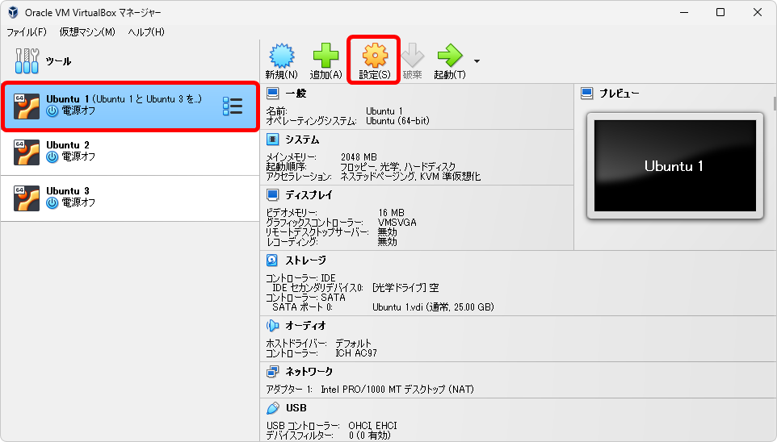

[TCP/IP＆ネットワークコマンド入門 サポートページ](https://nisim-m.github.io/tcpipcmdbook/) ～学習用環境～
# クローンの作成（Part 2）

2.7「異なるネットワークとの通信を試してみよう」では、テスト環境をもう1台追加して、経路情報を定義することで異なるネットワークとの通信を試します。

<!-- TOC -->

<!-- /TOC -->

## NATネットワーク用のデバイスを追加する

Ubuntu3という仮想環境を作成し、Ubuntu1・Ubuntu2とは異なるネットワークアドレスを設定したいのでNATネットワークを追加します。
（参考：<a href="https://nisim-m.github.io/tcpipcmdbook/howto/clone1-virtualbox.html">VirtualBoxの「NATネットワーク」とは</a>）

本書では、新しいNATネットワークデバイスで
`10.0.3.0/24`
`fd17:625c:f037:3::/64`
を使用しています。

「ファイル」→「ツール」→「ネットワークマネージャー」を選択

「NATネットワーク」タブで「作成」→「プロパティ」を設定して「適用」

設定内容は以下のとおりです：
名前（任意、変更不要）：`NatNetwork 1`

IPv4用の設定
IPv4プレフィックス：`10.0.3.0/24`
DHCPを有効化: `✓有効`

IPv6用の設定
IPv6を有効化: `✓有効`
IPv6プレフィックス:`fd17:625c:f037:3::/64`
IPv6デフォルトルートのアドバタイズ: `✓有効`

既存のNATネットワークで使用している「`10.0.2.0/24`」と「`fd17:625c:f037:2::/64`」とは異なるアドレスであれば設定は任意です。ここではそれぞれ2を3に変更した値を使用しています。

## 仮想マシン（Ubuntu 1）の クローンを作成する 

クローンを作成し、上で作成したネットワークデバイスを割り当てます。クローン元の仮想マシンは電源オフの状態になっている必要があるため、1台目の仮想マシンが「動作中」の状態になっている場合はシャットダウンしてください。

設定は以下のとおりです：
名前（任意）：`Ubuntu 3`
`すべてのネットワークアダプターでMACアドレスを生成`
`リンクしたクローン`

1台目の仮想マシン選択して「仮想マシン」→「クローン」

名前を変更し、MACアドレスのポリシーを「すべてのネットワークアダプターでMACアドレスを作成」を選択して「OK」

「リンクしたクローン」を選択して「完了」

## 作成した仮想マシン（Ubuntu 3）のネットワークデバイスを変更する

クローンで作成した仮想マシンのネットワークアダプター1を「NATネットワーク」にして、上で作成したネットワークデバイスを選択します。

新しく作成した仮想マシンを選択して「設定」をクリック

「ネットワーク」の「アダプター1」で割り当てを変更して「OK」

設定は以下のとおりです（アダプター1）:
ネットワークアダプターを有効化：`✓有効`（変更しない）
割り当て：`NATネットワーク`
名前：`NatNetwork1`（上で作成したネットワークデバイス）

## ホスト名を変更する
 
3台目の仮想マシンのホスト名（コンピューターの名前）を変更します。仮想マシンを起動して以下のコマンドを実行してください。ここでは、ubuntu3という名前にしています。

`sudo hostnamectl set-hostname ubuntu3`

なお、プロンプト（本文参照）は端末を開き直すことで反映されます。

※実行画面は<a href="https://nisim-m.github.io/tcpipcmdbook/howto/clone1-virtualbox.html#%E3%83%9B%E3%82%B9%E3%83%88%E5%90%8D%E3%82%92%E5%A4%89%E6%9B%B4%E3%81%99%E3%82%8B">Part 1</a>参照

## 1台目の仮想マシンにネットワークデバイスを追加する

最後に1台目の仮想マシンにネットワークデバイスを追加します。Ubuntu1はネットワークデバイスが2つ登録されている状態となります。

Ubuntu1を選択して「仮想マシン」→「設定（Ctrl+S）」で設定画面を開き、「ネットワーク」で
「アダプター2」の「割り当て」を「NATネットワーク」にして1で作成したネットワークデバイ
スを選択します 図D 。

1台目の仮想マシンを選択して「設定」をクリック

「ネットワーク」の「**アダプター2**」で割り当てを変更して「OK」

設定は以下のとおりです：
**アダプター2**
ネットワークアダプターを有効化：`✓有効`
割り当て：`NATネットワーク`
名前：`NatNetwork1`（上で作成したネットワークデバイス）

※アダプター1は変更しない

----
[TCP/IP＆ネットワークコマンド入門 サポートページ](https://nisim-m.github.io/tcpipcmdbook/)
