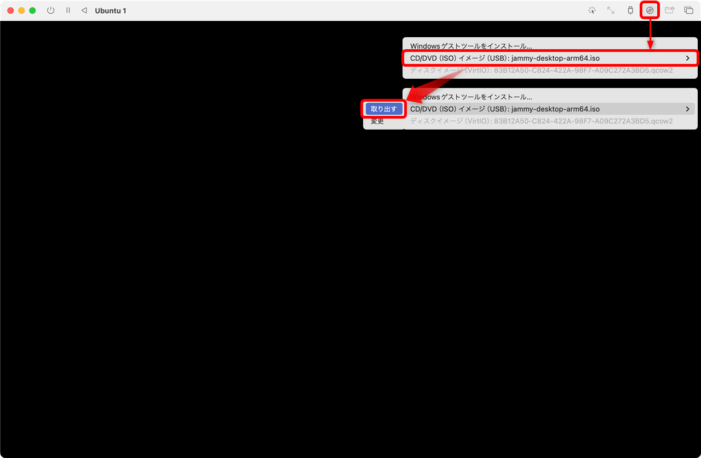

[TCP/IP＆ネットワークコマンド入門 サポートページ](https://nisim-m.github.io/tcpipcmdbook/) ～学習用環境（macOS + UTM + Ubuntu）～
# UTM + Ubuntu

<!-- TOC -->

1. [UTM + Ubuntu](#utm--ubuntu)
   1. [ファイルのダウンロード](#ファイルのダウンロード)
      1. [UTM](#utm)
      2. [UbuntuのISOイメージ](#ubuntuのisoイメージ)
      3. [UTMのインストールと起動](#utmのインストールと起動)
      4. [仮想マシンの作成](#仮想マシンの作成)
      5. [ゲストOS（Ubuntu）のインストール](#ゲストosubuntuのインストール)
      6. [Ubuntuデスクトップ](#ubuntuデスクトップ)
      7. [端末アプリ](#端末アプリ)

<!-- /TOC -->

## ファイルのダウンロード

macOS環境では、UTMと**ARM版**Ubuntuで学習環境を作成できます。

<small>*※Intel Macの場合はVirtualBoxが使用できるので、<a href="install-virtualbox.html">Windowsのページ</a>を参照してください。*</small>

### UTM

UTMは[https://mac.getutm.app/](https://mac.getutm.app/) で公開されています。無償版はDownloadボタンでダウンロードできます。違いはApp Storeで自動更新されるかどうかのみで機能は同じです（<a href="https://mac.getutm.app/#:~:text=difference">サイトの説明</a>より）。

### UbuntuのISOイメージ

**ARM版**Ubuntuのインストール用イメージファイルは [https://cdimage.ubuntu.com/jammy/daily-live/current/](https://cdimage.ubuntu.com/jammy/daily-live/current/) からダウンロードできます。**ARM**と書かれている方を選択してください。本書では、`jammy-desktop-arm64.iso`を使用しています。

### UTMのインストールと起動

ダウンロードしたUTM.dmgをダブルクリックで開き、UTMをApplicationsフォルダにドラッグ＆ドロップします。

アプリケーションフォルダのUTMをダブルクリックで起動

初回は確認メッセージが表示されるので「開く」をクリック

### 仮想マシンの作成

「新規仮想マシンを作成」をクリック

「仮想化」をクリック

「選択」でダウンロードしたISOイメージを選択して「続ける」

### ゲストOS（Ubuntu）のインストール

画面が黒くなったら
ドライブイメージのオプション（右から3番目、光学ディスクのアイコン）をクリックして「CD/DVD（ISO）イメージ」を「取り出す」
再起動ボタン　◁　（左側、名前の脇にあるアイコン）をクリックして再起動

### Ubuntuデスクトップ
Ubuntuデスクトップは以下の様な画面構成になっています。

### 端末アプリ

コマンドは「端末」アプリケーションで入力して実行します。アプリはdockに登録できます

----
[TCP/IP＆ネットワークコマンド入門 サポートページ](https://nisim-m.github.io/tcpipcmdbook/)
