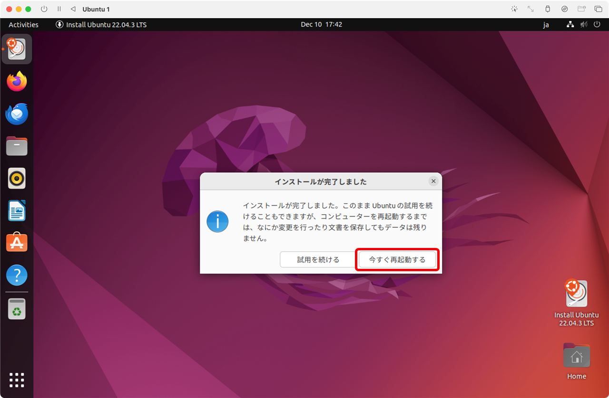

[TCP/IP＆ネットワークコマンド入門 サポートページ](https://nisim-m.github.io/tcpipcmdbook/) ～学習用環境（macOS + UTM + Ubuntu）～
# UTM + Ubuntu

<!-- TOC -->

1. [ファイルのダウンロード](#ファイルのダウンロード)
   1. [UTM](#utm)
   2. [UbuntuのISOイメージ](#ubuntuのisoイメージ)
2. [UTMのインストールと起動](#utmのインストールと起動)
3. [仮想マシンの作成](#仮想マシンの作成)
   1. [メモリーとハードディスクのサイズ](#メモリーとハードディスクのサイズ)
   2. [名前を設定して保存](#名前を設定して保存)
4. [ゲストOS（Ubuntu）のインストール](#ゲストosubuntuのインストール)
   1. [インストール時の設定](#インストール時の設定)
   2. [再起動後の設定](#再起動後の設定)
   3. [Ubuntuデスクトップ](#ubuntuデスクトップ)
      1. [端末アプリ](#端末アプリ)

<!-- /TOC -->

## ファイルのダウンロード

macOS環境では、UTMと**ARM版**Ubuntuで学習環境を作成できます。

<small>*※Intel Macの場合はVirtualBoxが使用できるので、<a href="install-virtualbox.html">Windowsのページ</a>を参照してください。*</small>

### UTM

UTMは[https://mac.getutm.app/](https://mac.getutm.app/) で公開されています。無償版はDownloadボタンでダウンロードできます。違いはApp Storeで自動更新されるかどうかのみで機能は同じです（<a href="https://mac.getutm.app/#:~:text=difference">サイトの説明</a>より）。

### UbuntuのISOイメージ

**ARM版**Ubuntuのインストール用イメージファイルは [https://cdimage.ubuntu.com/jammy/daily-live/current/](https://cdimage.ubuntu.com/jammy/daily-live/current/) からダウンロードできます。**ARM**と書かれている方を選択してください。本書では、`jammy-desktop-arm64.iso`を使用しています。

## UTMのインストールと起動

ダウンロードしたUTM.dmgをダブルクリックで開き、UTMをApplicationsフォルダにドラッグ＆ドロップします。

アプリケーションフォルダにドラッグ＆ドロップ

アプリケーションフォルダのUTMをダブルクリックで起動

初回は確認メッセージが表示されるので「開く」をクリック

## 仮想マシンの作成

「新規仮想マシンを作成」で仮想マシンを作成し、ゲストOS（Ubuntu）をインストールします。

「新規仮想マシンを作成」をクリック

「仮想化」を選択

「Linux」を選択

「選択」でダウンロードしたISOイメージを選択して「続ける」

### メモリーとハードディスクのサイズ

デフォルトのままで問題ありません。

ゲストOSに割り当てるメモリーのサイズは、たくさん割り当てることでゲストOSが快適に動作するようになりますが、その分、ホストOSの動作が犠牲になります。 本書のネットワークコマンドを試すだけであれば、1024～2048MB程度で問題ありません。ハードディスクのサイズも25GBで問題ありませんが、本書で紹介している以外のソフトウェアも試してみたいという場合はもう少し大きくしておく方が扱いやすいでしょう。ディスクスペースは仮想OS側で使用した分だけが消費されます。

### 名前を設定して保存

仮想マシンの名前を決めて「保存」をクリックします。ここでは「Ubuntu 1」としています。名前は後でも変更可能です。

## ゲストOS（Ubuntu）のインストール

仮想マシンの電源を入れるとISOイメージからUbuntuが起動します。
デスクトップにインストール用のアイコンがあるのでダブルクリックで実行し、画面に従ってインストールしてください。

▶をクリックして電源ON

「Try or Install Ubuntu」を選択した状態で<kbd>return</kbd>

（起動中）

アクセス許可のメッセージが表示されたら適宜「許可しない」または「OK」をクリック（本書ではマイクを使用しません）

起動中にエラーメッセージが表示されることがあります。ここでは無視して問題ありません。

デスクトップにインストール用のアイコン（ここでは「Install Ubuntu 22.04.3 LTS」）があるのでダブルクリックで実行し、画面に従ってインストールしてください。

「Install Ubuntu 22.04.3 LTS」を実行

Welcomeメニューが表示されたら左側の言語一覧をスクロール

日本語を選択して「続ける」をクリック

### インストール時の設定

画面に従ってインストールを進めます。「続ける」というボタンは画面の右下に表示されています。

キーボードを選択して「続ける」をクリック

「通常のインストール」のまま「続ける」をクリック

<small>※本書の学習範囲の場合「最小インストール」でも問題ありません。アプリケーションはインストール後に適宜追加可能です。</small>

「ディスクを削除してUbuntuをインストール」のまま「インストール」をクリック

<small>※ここで言う「ディスク」とは仮想ディスクのことで、実環境には影響しません。</small>

「ディスクに変更を書き込みますか？」というメッセージが表示されるので「続ける」をクリック

地域を選択して「続ける」をクリック

ユーザー名、コンピューター名、パスワードを入力して「続ける」をクリック

（インストール中）

再起動を促すメッセージが表示されるので、「今すぐ再起動する」をクリック

再起動時、画面が黒くなったら
❶ドライブイメージのオプション（右から3番目、光学ディスクのアイコン）をクリックして「CD/DVD（ISO）イメージ」を「取り出す」
❷再起動ボタン（左側、名前の脇にある◁のアイコン）をクリックして再起動

（再起動中）

### 再起動後の設定
再起動するとGUI画面が表示されるのでインストールを完了させます。

ユーザーを選択してパスワードを入力

起動後に内部エラーのメッセージが表示されることがあります。レポートの送信は任意です。

オンラインアカウントへの接続（任意）※学習用の環境なので接続は不要

Ubuntu Proの有効化（任意）※学習用の環境なので不要

エラーリポートの送信（任意）

位置情報サービスの設定（任意）

完了

### Ubuntuデスクトップ
Ubuntuデスクトップは以下の様な画面構成になっています。

#### 端末アプリ

コマンドは「端末」アプリケーションで入力して実行します。アプリはdockに登録できます。

このままで問題なく使用できますが、画面オフまでの時間などを設定すると使い勝手が良くなります。設定方法は「<a href="./install-virtualbox.html#ubuntuの設定">Ubuntuの設定</a>」を参照してください。

----
[TCP/IP＆ネットワークコマンド入門 サポートページ](https://nisim-m.github.io/tcpipcmdbook/)
