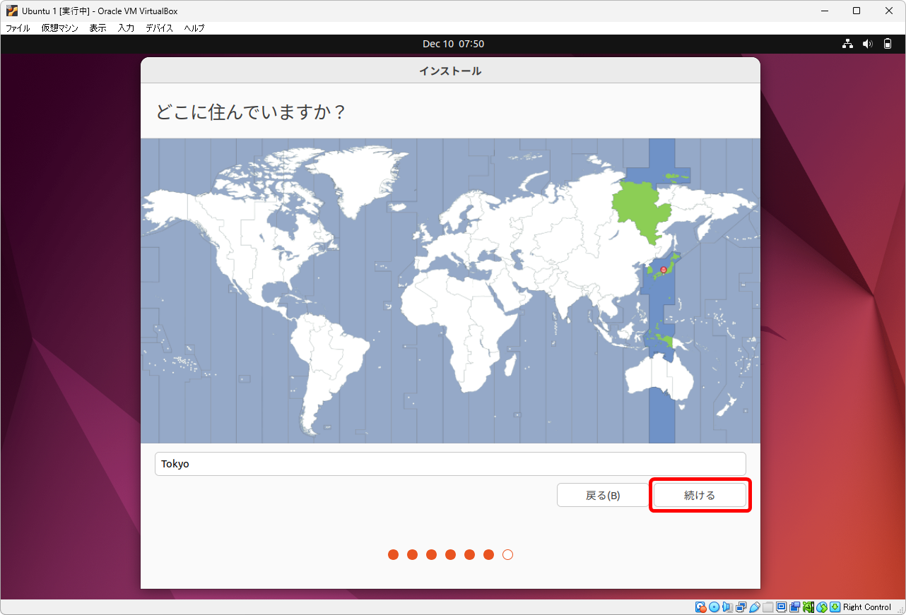

[TCP/IP＆ネットワークコマンド入門 サポートページ](https://nisim-m.github.io/tcpipcmdbook/) ～学習用環境（Windows + VirtualBox + Ubuntu）～
# VirtualBox + Ubuntu

<!-- TOC -->

1. [VirtualBox + Ubuntu](#virtualbox--ubuntu)
   1. [ファイルのダウンロード](#ファイルのダウンロード)
      1. [VirtualBox](#virtualbox)
      2. [UbunutuのISOイメージ](#ubunutuのisoイメージ)
   2. [VirtualBoxのインストール](#virtualboxのインストール)
   3. [仮想マシンの作成](#仮想マシンの作成)
      1. [名前とオペレーティングシステムの選択](#名前とオペレーティングシステムの選択)
      2. [メモリーサイズ、ハードディスクサイズ](#メモリーサイズハードディスクサイズ)
   4. [ゲストOS（Ubuntu）のインストール](#ゲストosubuntuのインストール)
      1. [インストール時の設定](#インストール時の設定)
      2. [再起動](#再起動)
      3. [再起動後の設定](#再起動後の設定)
      4. [Guest Additionsのインストール](#guest-additionsのインストール)
      5. [Ubuntuの設定](#ubuntuの設定)
      6. [スナップショットの活用](#スナップショットの活用)

<!-- /TOC -->

## ファイルのダウンロード

### VirtualBox

[https://www.virtualbox.org/wiki/Downloads](https://www.virtualbox.org/wiki/Downloads)
**VirtualBox xx.xx.xx platform packages**にOS別のダウンロードリンクがあるので、Windows Hostsをクリックしてインストーラーをダウンロードしてください。本書では7.0.12を使用しています。

### UbunutuのISOイメージ

インストール用のイメージファイルは [https://jp.ubuntu.com/download](https://jp.ubuntu.com/download) からダウンロードできます。本書では、Ubuntu Desktop 22.04.3 LTS（`ubuntu-22.04.3-desktop-amd64.iso`）を使用しています。

## VirtualBoxのインストール

VirtualBoxのインストーラーを実行し、画面に従ってインストールしてください。

<small>*※<a href="https://nisim-m.github.io/linuxcmdbook/howto/images/2023-01-02-17-16-54.png">“Oracle VM VirtualBox 7.x.x needs the Microsoft Visual C++ 2019 Redistributable Packaging being installed first.”のようなメッセージ</a>が表示された場合、Microsoftのサイトからダウンロードしてインストールしてください。（<a href="https://visualstudio.microsoft.com/ja/downloads/">https://visualstudio.microsoft.com/ja/downloads/</a> “Microsoft Visual C++ Redistributable for Visual Studio 2022” <a href="https://nisim-m.github.io/linuxcmdbook/howto/install-vcpp.html">画面例）</a>*</small>

画面例（Windows環境の状態やVirtualBoxのバージョンによって異なる画面が表示される可能性があります）：

## 仮想マシンの作成

VirtualBoxを実行し、仮想マシン(M)→新規(N)で仮想マシンを作成、ゲストOS（Ubuntu）をインストールします。

### 名前とオペレーティングシステムの選択

仮想マシンの名前を決めて、<a href="#ubunutuのisoイメージ">ダウンロードしたUbuntuのISOイメージ</a>を選択します。
「自動インストールをスキップ」にチェックマークを入れて、「次へ」で進みます。

❶「名前」を入力（ここでは「Ubuntu 1」としています）
❷「ISOイメージ」でUbuntuのISOイメージを選択
❸「自動インストールをスキップ」にチェックマークを入れる※

<small>*※VirtualBoxのバージョンによっては「Skip Unattended Installation」と表示されます。この場合もチェックマークを入れてください。*</small>

### メモリーサイズ、ハードディスクサイズ

この他の設定はデフォルトのままで問題ありません。

ゲストOSに割り当てるメモリーのサイズは、たくさん割り当てることでゲストOSが快適に動作するようになりますが、その分、ホストOSの動作が犠牲になります。
本書のネットワークコマンドを試すだけであれば、1024～2048MB程度で問題ありません。ハードディスクのサイズも25GBで問題ありませんが、本書で紹介している以外のソフトウェアも試してみたいという場合はもう少し大きくしておく方が扱いやすいでしょう。ディスクスペースは仮想OS側で使用した分だけが消費されます。

## ゲストOS（Ubuntu）のインストール

「起動」をクリックすると、仮想マシンの作成時に選択たISOイメージからUbuntuが起動するので、画面に従ってインストールを行います。

起動をクリック

起動メニューが表示（Try or Install Ubuntuが選択された状態になっている）

画面をクリックすると「キャプチャー」についての説明が表示される

「Try or Install Ubuntu」を選択した状態でEnter

Ubuntuが起動する

Welcomeメニューが表示されたら左側の言語一覧をスクロール

日本語を選択して「Ubuntuをインストール」をクリック

### インストール時の設定

画面に従ってインストールを進めます。「続ける」というボタンは画面の右下に表示されています。 
<small>*※ボタンが画面上に表示されない場合はAlt+F7でスクロール（<a href="https://nisim-m.github.io/linuxcmdbook/howto/altf7.html">画面例</a>）*</small>

キーボードを選択して「続ける」をクリック

「通常のインストール」のまま「続ける」をクリック

<small>*※本書の学習範囲の場合「最小インストール」でも問題ありません。アプリケーションはインストール後に適宜追加可能です。*</small>

「ディスクを削除してUbuntuをインストール」のまま「インストール」をクリック

<small>*ここで言う「ディスクを削除」とは仮想ディスクのことで、実環境には影響しません。*</small>

「ディスクに変更を書き込みますか？」というメッセージが表示されるので「続ける」をクリック

地域を選択して「続ける」をクリック

ユーザー名、コンピューター名、パスワードを入力して「続ける」をクリック

（インストール中）

### 再起動

再起動を促すメッセージが表示されるので、「今すぐ再起動する」をクリック

（"Please remove the installation medium, then press ENTER:"と表示されている場合は画面をクリックしてEnterを押す）

### 再起動後の設定

再起動するとGUI画面が表示されるのでインストールを完了させます。

ユーザーを選択してパスワードを入力

オンラインアカウントへの接続（任意）※学習用の環境なので接続は不要

Ubuntu Proの有効化（任意）※学習用の環境なので不要

エラーリポートの送信（任意）

位置情報サービスの設定（任意）

完了

※セットアップ中に「ソフトウェアの更新」が入った場合は「あとで再起動」として、セットアップを完了させてください。

### Guest Additionsのインストール

<a href="https://nisim-m.github.io/linuxcmdbook/howto/install-ubuntu.html#guest-additions%E3%81%AE%E3%82%A4%E3%83%B3%E3%82%B9%E3%83%88%E3%83%BC%E3%83%AB">（参考）</a>

### Ubuntuの設定

<a href="https://nisim-m.github.io/linuxcmdbook/howto/install-ubuntu.html#ubuntu%E3%81%AE%E8%A8%AD%E5%AE%9A">（参考）</a>

### スナップショットの活用

<a href="https://nisim-m.github.io/linuxcmdbook/howto/install-ubuntu.html#%E3%82%B9%E3%83%8A%E3%83%83%E3%83%97%E3%82%B7%E3%83%A7%E3%83%83%E3%83%88%E3%81%AE%E6%B4%BB%E7%94%A8">（参考）</a>

----

[TCP/IP＆ネットワークコマンド入門 サポートページ](https://nisim-m.github.io/tcpipcmdbook/)
