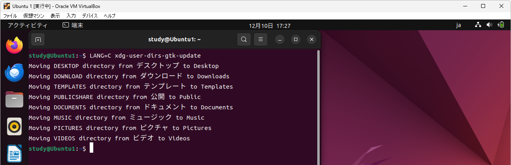

[TCP/IP＆ネットワークコマンド入門 サポートページ](https://nisim-m.github.io/tcpipcmdbook/) ～学習用環境（Windows + VirtualBox + Ubuntu）～
# VirtualBox + Ubuntu

<!-- TOC -->

1. [ファイルのダウンロード](#ファイルのダウンロード)
   1. [VirtualBox](#virtualbox)
   2. [UbunutuのISOイメージ](#ubunutuのisoイメージ)
2. [VirtualBoxのインストール](#virtualboxのインストール)
3. [仮想マシンの作成](#仮想マシンの作成)
   1. [名前とオペレーティングシステムの選択](#名前とオペレーティングシステムの選択)
   2. [メモリーサイズ、ハードディスクサイズ](#メモリーサイズハードディスクサイズ)
4. [ゲストOS（Ubuntu）のインストール](#ゲストosubuntuのインストール)
   1. [インストール時の設定](#インストール時の設定)
   2. [再起動後の設定](#再起動後の設定)
      1. [Ubuntuデスクトップ](#ubuntuデスクトップ)
      2. [端末アプリ](#端末アプリ)
   3. [Guest Additionsのインストール](#guest-additionsのインストール)
      1. [解像度の変更](#解像度の変更)
      2. [クリップボードの共有](#クリップボードの共有)
5. [スナップショットの活用](#スナップショットの活用)
6. [Ubuntuの設定](#ubuntuの設定)
   1. [フォルダ名をアルファベットにする](#フォルダ名をアルファベットにする)
7. [ネットワークが切断されてしまった場合](#ネットワークが切断されてしまった場合)

<!-- /TOC -->

## ファイルのダウンロード

### VirtualBox

[https://www.virtualbox.org/wiki/Downloads](https://www.virtualbox.org/wiki/Downloads)
**VirtualBox xx.xx.xx platform packages**にOS別のダウンロードリンクがあるので、Windows Hostsをクリックしてインストーラーをダウンロードしてください。本書では7.0.12を使用しています。

### UbunutuのISOイメージ

インストール用のイメージファイルは [https://jp.ubuntu.com/download](https://jp.ubuntu.com/download) からダウンロードできます。本書では、Ubuntu Desktop 22.04.3 LTS（`ubuntu-22.04.3-desktop-amd64.iso`）を使用しています。

## VirtualBoxのインストール

VirtualBoxのインストーラーを実行し、画面に従ってインストールしてください。

<small>*※<a href="https://nisim-m.github.io/linuxcmdbook/howto/images/2023-01-02-17-16-54.png">“Oracle VM VirtualBox 7.x.x needs the Microsoft Visual C++ 2019 Redistributable Packaging being installed first.”のようなメッセージ</a>が表示された場合、Microsoftのサイトからダウンロードしてインストールしてください。（<a href="https://visualstudio.microsoft.com/ja/downloads/">https://visualstudio.microsoft.com/ja/downloads/</a> “Microsoft Visual C++ Redistributable for Visual Studio 2022” <a href="https://nisim-m.github.io/linuxcmdbook/howto/install-vcpp.html">画面例）</a>*</small>

VirtualBoxのインストール（Windows環境の状態やVirtualBoxのバージョンによって異なる画面が表示される可能性があります）

## 仮想マシンの作成

VirtualBoxを実行し、仮想マシン(M)→新規(N)で仮想マシンを作成、ゲストOS（Ubuntu）をインストールします。

### 名前とオペレーティングシステムの選択

仮想マシンの名前を決めて、<a href="#ubunutuのisoイメージ">ダウンロードしたUbuntuのISOイメージ</a>を選択します。
「自動インストールをスキップ」にチェックマークを入れて、「次へ」で進みます。

❶「名前」を入力（ここでは「Ubuntu 1」としています）
❷「ISOイメージ」でUbuntuのISOイメージを選択
❸「自動インストールをスキップ」にチェックマークを入れる※

<small>*※VirtualBoxのバージョンによっては「Skip Unattended Installation」と表示されます。この場合もチェックマークを入れてください。*</small>

### メモリーサイズ、ハードディスクサイズ

この他の設定はデフォルトのままで問題ありません。

ゲストOSに割り当てるメモリーのサイズは、たくさん割り当てることでゲストOSが快適に動作するようになりますが、その分、ホストOSの動作が犠牲になります。
本書のネットワークコマンドを試すだけであれば、1024～2048MB程度で問題ありません。ハードディスクのサイズも25GBで問題ありませんが、本書で紹介している以外のソフトウェアも試してみたいという場合はもう少し大きくしておく方が扱いやすいでしょう。ディスクスペースは仮想OS側で使用した分だけが消費されます。

## ゲストOS（Ubuntu）のインストール

「起動」をクリックすると、仮想マシンの作成時に選択たISOイメージからUbuntuが起動するので、画面に従ってインストールを行います。

起動をクリック

起動メニューが表示（Try or Install Ubuntuが選択された状態になっている）

画面をクリックすると「キャプチャー」についての説明が表示される

<small>ゲストOSの画面をクリックすると、キー操作やマウス入力をゲストOSが受け取る状態（キャプチャーされた状態）となります。ホストOS側を操作したい場合は、右側のCtrlキーを押します。このキーを**ホストキー**と言い、VirtualBoxの右下にも表示されています。</small>

「Try or Install Ubuntu」を選択した状態で<kbd>Enter</kbd>

Ubuntuが起動する

Welcomeメニューが表示されたら左側の言語一覧をスクロール

日本語を選択して「Ubuntuをインストール」をクリック

### インストール時の設定

画面に従ってインストールを進めます。「続ける」というボタンは画面の右下に表示されています。 
<small>*※ボタンが画面上に表示されない場合はAlt+F7でスクロール（<a href="https://nisim-m.github.io/linuxcmdbook/howto/altf7.html">画面例</a>）*</small>

キーボードを選択して「続ける」をクリック

「通常のインストール」のまま「続ける」をクリック

<small>*※本書の学習範囲の場合「最小インストール」でも問題ありません。アプリケーションはインストール後に適宜追加可能です。*</small>

「ディスクを削除してUbuntuをインストール」のまま「インストール」をクリック

<small>*ここで言う「ディスク」とは仮想ディスクのことで、実環境には影響しません。*</small>

「ディスクに変更を書き込みますか？」というメッセージが表示されるので「続ける」をクリック

地域を選択して「続ける」をクリック

ユーザー名、コンピューター名、パスワードを入力して「続ける」をクリック

（インストール中）

再起動を促すメッセージが表示されるので、「今すぐ再起動する」をクリック

（"Please remove the installation medium, then press ENTER:"と表示されている場合は画面をクリックしてEnterを押す）

### 再起動後の設定

再起動するとGUI画面が表示されるのでインストールを完了させます。

ユーザーを選択してパスワードを入力

オンラインアカウントへの接続（任意）※学習用の環境なので接続は不要

Ubuntu Proの有効化（任意）※学習用の環境なので不要

エラーリポートの送信（任意）

位置情報サービスの設定（任意）

完了

※セットアップ中に「ソフトウェアの更新」が入った場合は「あとで再起動」として、セットアップを完了させてください。

#### Ubuntuデスクトップ

Ubuntuデスクトップは以下の様な画面構成になっています。

#### 端末アプリ

コマンドは「端末」アプリケーションで入力して実行します。アプリはdockに登録できます。

### Guest Additionsのインストール

「Guest Additions」をインストールすると、ホストOSと端末の間でのコピー&ペーストが可能になります。

「デバイス」→「Guest Additions CDイメージの挿入」を選択

「autorun\.sh」を右クリック→「プログラムとして実行」

ゲストOSインストール時に設定したパスワードを入力

<small>このメッセージが表示されない場合、autorun.shが実行できていない可能性があります。端末で `sudo /media/ユーザー名/VBox_GAs_バージョン /VBoxLinuxAdditions.run` を実行してください。
`sudoスペース/me`<kbd>Tab</kbd>`ユーザー名/V`<kbd>Tab</kbd>`VBoxL`<kbd>Tab</kbd><kbd>Enter</kbd>で実行できます（コマンド補完：本文参照）。</small>

（autorun.sh実行中）

途中で解像度が変わり、「Press Return to close this window...」と表示されたら<kbd>Enterキー</kbd>を押して終了

CD（仮想ディスク）を取り出して再起動

#### 解像度の変更
解像度は再起動後「設定」から変更できます。

「設定」をクリック

スクロールして「ディスプレイ」を探し、クリックして「解像度」を変更

「適用」で保存

<small>※解像度はVirtualBoxの「表示」メニューや、ウィンドウサイズの変更でも調整可能</small>

#### クリップボードの共有

「Guest Additions」をインストールしてUbuntuを再起動し、「デバイス」→「クリップボードの共有」を有効にすることで、ホストOSと端末の間でのコピー&ペーストが可能になります。

デバイス→クリップボードの共有で設定

## スナップショットの活用

VirtualBoxでは、任意のタイミングでゲストOSのスナップショットを作成しておくことができます。本書の学習ではあまり必要ありませんが、興味がある方は以下を参考にしてください。

<a href="https://nisim-m.github.io/linuxcmdbook/howto/install-ubuntu.html#%E3%82%B9%E3%83%8A%E3%83%83%E3%83%97%E3%82%B7%E3%83%A7%E3%83%83%E3%83%88%E3%81%AE%E6%B4%BB%E7%94%A8">スナップショットの活用（Linux1＋コマンド入門サポートページ内）</a>

## Ubuntuの設定

学習の性質上、画面を見ているが操作はしない、という時間が長くなりがちです。デフォルトでは操作していないと5分で画面がオフになりますが、この時間は「電源管理」の「省電力オプション」で設定できます。

デスクトップの設定は「Ubuntuソフトウェア」の「Extension Manager」でもカスタマイズできます（例：Hide ClockエクステンションでTopパネルのカレンダーを非表示にする、等）。

### フォルダ名をアルファベットにする

ユーザーフォルダ（ユーザーのホームディレクトリ）にある「書類」や「ピクチャ」などのフォルダは、WindowsやmacOSの場合、実体はDocumentsやPicturesなどのアルファベットで付けられた名前になっていますが、日本語用にインストールしたUbuntuデスクトップの場合は実体も「書類」など日本語の名前になっています。本書ではコマンドラインでこれらのフォルダを扱うことはありませんが、今後、コマンドラインでほかの操作にも慣れていこうという場合、アルファベットの名前の方が扱いやすいでしょう。変更する場合は以下のコマンドを実行し画面の指示に従ってください。

<code>
LANG=C xdg-user-dirs-gtk-update
</code>

<small>※`LANG=C`スペース`xdg-u`<kbd>Tab</kbd>`s-g`<kbd>Tab</kbd><kbd>Enter</kbd>で実行できます。パスワード入力を求められたらUbuntuインストール時のパスワードを入力してください。</small>

Update standard folders～というメッセージが表示されるので「Update Names」をクリック

ディレクトリ（フォルダ）名が変更される

再起動後あらためてフォルダ名の変更を確認するメッセージが表示されたら「次回から表示しない」にチェックマークを入れて「古い名前のままにする」をクリックしてください。

## ネットワークが切断されてしまった場合

VirtualBoxのUbuntuを起動したままホストOSがスリープ状態になると、復帰後のUbuntuでネットワークが使えなくなることがあります。

VirtualBoxの「デバイス」メニューで「ネットワーク」の「ネットワークアダプターを接続」をクリックしていったん切断し、再度、「ネットワークアダプターを接続」をクリックして接続し直してください。

Ubuntuの再起動でも元の状態に戻ります。よくわからない時はいったん再起動してみてください。

----

[TCP/IP＆ネットワークコマンド入門 サポートページ](https://nisim-m.github.io/tcpipcmdbook/)
