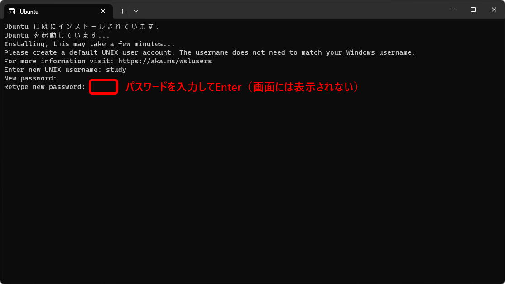

[TCP/IP＆ネットワークコマンド入門 サポートページ](https://nisim-m.github.io/tcpipcmdbook/) ～学習用環境（WSL）～
# WSL (Windows Subsystem for Linux)

<!-- TOC -->

1. [WSL (Windows Subsystem for Linux)](#wsl-windows-subsystem-for-linux)
   1. [Windows機能の有効化](#windows機能の有効化)
   2. [Ubuntuのインストール](#ubuntuのインストール)
      1. [WSLの実行](#wslの実行)

<!-- /TOC -->

## Windows機能の有効化

WSLを使用するには、「Windowsの機能の有効化または無効化」で「Linux用Windowsサブシステム」と「仮想マシンプラットフォーム」を有効にして再起動します。

「Windowsの機能の有効化または無効化」を開く（スタートメニューで「Windowsの機能」を検索）

「Linux用Windowsサブシステム」にチェックマークを入れる

「仮想マシンプラットフォーム」にチェックマークを入れる

<small>※VMware（VirtualBoxと同じくGUIベースの仮想環境を構築できる仮想化ソフトウェア）とWSLを混在させる場合、上記2つに加えて「Hyper-V」と「Windowsハイパーバイザープラットフォーム」にもチェックマークを入れて有効にする必要があります。</small>

再起動

## Ubuntuのインストール

再起動したらコマンドラインでwsl --install –d Ubuntuを実行してUbuntuをインストールして再起動します。

「コマンドプロンプト」を開く（スタートメニューで「コマンド」または「cmd」を検索）

`wsl --install –d Ubuntu`と入力して<kbd>Enter</kbd>

（インストール中）

（インストール中）

（インストールが完了した）

スタートメニューから再起動

再起動するとコマンドプロンプトの画面が開き、Linuxの初期設定が始まります。
しばらく待つと「Enter new Unix username:」と表示されるので、WSL利用時のユーザー名を決めて入力してください。
Windowsのユーザーと共通でも異なる名前でも問題ありませんが、アルファベットの小文字にしておくと入力しやすく扱いやすくなります。

WSL用のユーザー名を入力して<kbd>Enter</kbd>

ユーザー名を入力してEnter を押すと「New Password:」と表示されるので、いま作成したユーザー用のパスワードを決めて入力します。

WSL用のパスワードを入力して<kbd>Enter</kbd>

確認のため再度パスワードを入力して<kbd>Enter</kbd>

セットアップ完了

プロンプトの記号が「$」に変わり、この後使用するipコマンドやncコマンドなどのLinuxコマンドが実行可能になります。
（➡p.21 0.4　学習用の環境を準備しよう「WSLの活用」➡p.44 0.10　Windowsコマンドライン「WSL」）

`exit`<kbd>Enter</kbd>でWSLが終了し、Windowsのコマンドプロンプト（>）に戻ります。
もう一度`exit`<kbd>Enter</kbd>と実行するとコマンドプロンプトが終了します。
※`exit`コマンドを使わずコマンドプロンプトのウィンドウを閉じても問題ありません。

### WSLの実行

コマンドプロンプトで`wsl`<kbd>Enter</kbd>、またはスタートメニューでWSLを検索して実行します。
両者の違いは実行時のカレントディレクトリで、前者はwslコマンド実行時のカレントディレクトリ（スタートメニューからコマンドプロンプトを実行した場合はWindowsユーザーのホームディレクトリ、標準ではC:\Users\Windowsのユーザー名）、後者はwslユーザーのホームディレクトリとなります。
本書ではコマンドプロンプトから実行する方法を取っていますが、ネットワークコマンドの実行という点に於いては両者の違いはありません。お好みの方法で実行してください。

----
[TCP/IP＆ネットワークコマンド入門 サポートページ](https://nisim-m.github.io/tcpipcmdbook/)
