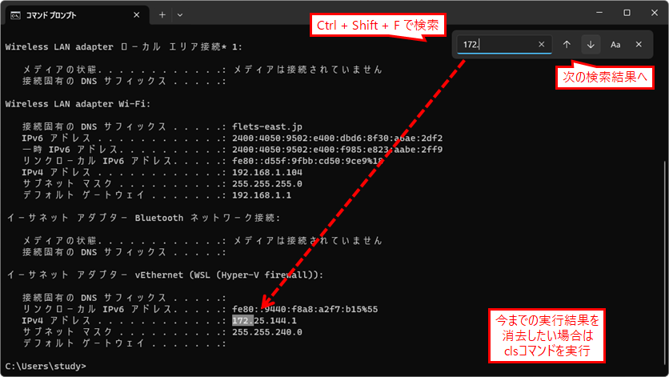
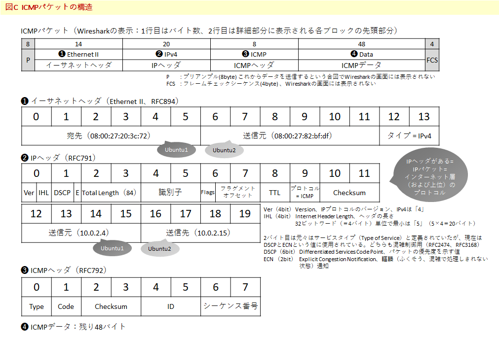
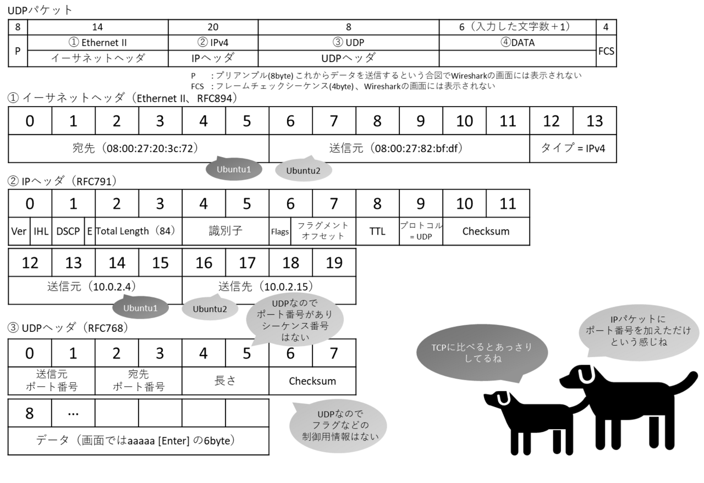
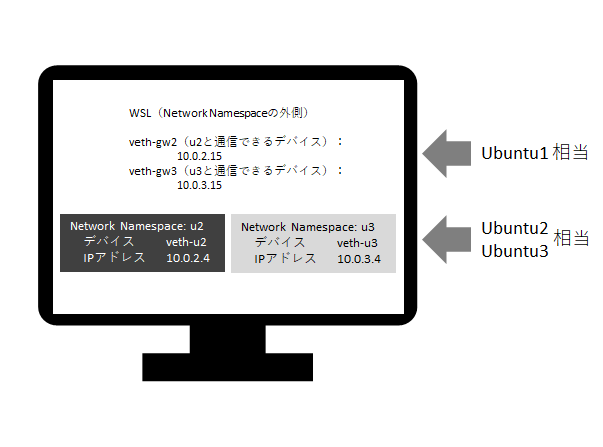

# TCP/IP＆ネットワークコマンド入門
——プロトコルとインターネット、基本の力［Linux/Windows/macOS対応］

[技術評論社](https://gihyo.jp/book/2024/978-4-297-14132-5/) 
[Amazon](https://www.amazon.co.jp/dp/4297141329/)  
2024.5.2

 [TCP/IP＆コマンドラインQuickリファレンス](https://gihyo.jp/assets/files/book/2024/978-4-297-14132-5/download/TCPIP%EF%BC%86%E3%82%B3%E3%83%9E%E3%83%B3%E3%83%89%E3%83%A9%E3%82%A4%E3%83%B3Quick%E3%83%AA%E3%83%95%E3%82%A1%E3%83%AC%E3%83%B3%E3%82%B9.pdf) 
<small>読者の方向けのQuickリファレンスです。文中の「➡X.X節」などは書籍内の関連箇所への参照を示しています。</small>

## 学習用環境

**Windows環境：**
[VirtualBox+Ubuntuのインストール](howto/install-virtualbox.md) 
　[Clone (Part1用、仮想マシンを追加して通信を試す)](howto/clone1-virtualbox.md) 
　[Clone (Part2用、ネットワークを追加する)](howto/clone2-virtualbox.md) 
[WSL (Windows Subsystem for Linux) のインストール](howto/install-wsl.md)

**macOS環境：**
[macOS+UTM+Ubuntuのインストール](howto/install-utm.md) 
　[Clone (Part1用、仮想マシンを追加して通信を試す)](howto/clone1-utm.md) 
　[Clone (Part2用、ネットワークを追加する)](howto/clone2-utm.md) 

### 補足事項

[HTTP/3に対応したcurlコマンドの構築](howto/curl-http3.md) 
<small>※「4.4 HTTP/HTTPSの通信を見てみよう」内「参考：curlによるHTTP/3通信」で使用</small>

## 正誤表

|ページ|内容|
|-|-|
|1.7（p.91）|誤：ICMPv2プロトコル 正：ICMPv**6**プロトコル 他ページの記載が正しいです|

（以下、第2刷以降、修正反映済み）
|ページ|内容|
|-|-|
|0.10（p.48） 図F|実行結果の検索(Windows Terminal) 誤：Ctrl+Shift+S 正：Ctrl+Shift+<b>F</b>（👉）|
|1.2 (p.67)|ifconfigコマンドのUbuntu環境へのインストールについて 誤：sudo apt install inet-tools 正：sudo apt install <strong>net-tools</strong>|
|1.5 (p.76)|誤：「Enable IPv6」にチェックマーク 正：「IPv6を有効化」にチェックマーク <small>（※VirtualBoxバージョンによって変更される可能性があるので画面に従ってください）</small>|
|2.5 (p.122) 図C|ICMPヘッダー 誤: 16バイト 正: 8バイト 正: ❸ICMPヘッダーのタイムスタンプを削除 （👉）|
|2.6 (p.128) 図B|誤 10.0.2.15から10.0.2.4へのpingには応答がない 10.0.2.4から10.0.2.15へのpingには応答がある 正 10.0.2.4から10.0.2.15へのpingには応答がない 10.0.2.15から10.0.2.4へのpingには応答がある|
|2.7 (p.130)|誤：「Enable IPv6」にチェックマーク 正「IPv6を有効化」にチェックマーク|
|3.3 (p.173) 図E|UDPパケットを見てみよう 最上部概要の表内 誤:40または36/❸TCP/TCPヘッダー 正:8/❸UDP/UDPヘッダー（👉）|
|4.4 (p.215)|2つめの実行画面内、4行目GETの行で末尾の「1」が欠けていました。正：GET / HTTP/1.<strong>1</strong>|
|4.10 (p.263) 図A|右下Ubuntu3相当のNetwork Namespaceの記載がu2になっていますが正しくはu3、デバイスはveth-u<strong>3</strong>、IPアドレスは10.0.<strong>3</strong>.4です（👉）|
|4.10 (p.264)|誤：u3用のveth-u2、veth-gw3というペア 正：u3用のveth-u<strong>3</strong>、veth-gw3というペア|

## 履歴

- 2024.5 サポートページ公開
- 2024.5.15 正誤表追加（2.5 図C、2.6 図B）
- 2024.5.20 正誤表追加（1.5、2.7、4.4、4.10 図A、4.10本文）
- 2024.6.9 正誤表追加（0.10 図F）
- 2024.6.19 正誤表追加（1.2）
- 2024.10.3 正誤表追加（3.3）
- 2025.5.13 [ARM版Ubuntu DesktopのISOイメージダウンロードURL](https://nisim-m.github.io/tcpipcmdbook/howto/download-ubuntu-arm.html)について追記

----
[TCP/IP＆ネットワークコマンド入門 サポートページ](https://nisim-m.github.io/tcpipcmdbook/)
